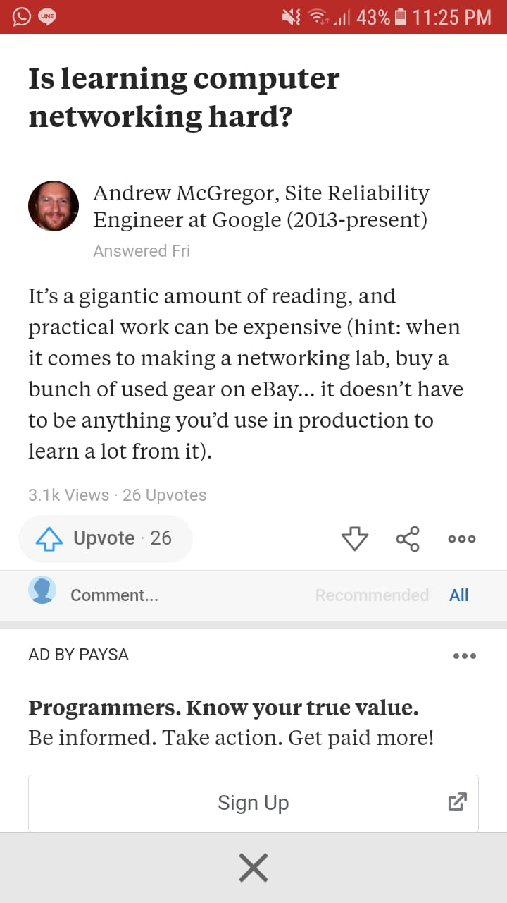

I am a noob in computer networks. In fact, I am a noob in everything. The funny thing is I didn't like computer networks when I was started learning it in the Bachelor's, but now my work is around this area, especially cloud and edge infrastructure. Back then, I used to put most of my time and effort to learn embedded systems and robotics. I was not intereste in computer networks because the lecture at that time was a copy-paste from Cisco module. It was boring as hell.

However, by the end of my Bachelor's study, I had to learn it because somehow my thesis was around the IoT network. So, here is what I learned about studying computer networks.

# Learning computer networks involves a lot of reading

Like...a lot. We need to read books, tutorial, blogs, papers, and in many cases we also need to read standards such as RFCs from IETF and some other standards by W3C, 3GPP, or ETSI. Reading standards is needed when we need to code/build something based on it.

Andrew McGregor also said we need to read a lot.

Tech blogs from companies such as [Cloudflare blog](https://blog.cloudflare.com/), [Facebook blog and research](https://research.fb.com/blog/), [Google publication](https://research.google/), and [Dropbox tech blog](https://blogs.dropbox.com/tech/category/infrastructure/) are the examples of good blogs for learning networks.

# To me, it's easier to do top-down approach

When I was in a Bachelor's, the course taught from the physical layer up to the application layer. It is understandable to teach it that way, because that's how it is built. However, for a learning purpose, I find it harder to understand.

Consider this example; when we were in the elementary school, we were taught that the area of a circle is $\pi r^2$ without knowing where the formulae comes from. Then we go deeper as we go to higher grade and finally comes to the detail when we were in the college. So, learning from the surface to the bottom is not a new approach.

I found it easier to do top-down approach, then followed by whatever we need to focus on. The book "Computer Networking: A Top-Down Approach" [[amazon](https://www.amazon.com/Computer-Networking-Top-Down-Approach-7th/dp/0133594149)] is very readable and I enjoyed reading it. 

The top-down approach book is not that comprehensive on some parts like routing protocol, because the aim of the book is to introduce computer networks to Bachelor's student. I continued by reading "Computer Networking : Principles, Protocols and Practice" [[open.umn.edu](https://open.umn.edu/opentextbooks/textbooks/computer-networking-principles-protocols-and-practice)] which is deeper on some topics like TCP congestion control and routing protocol. I also found the "TCP/IP Networking" course from EPFL excellent, which we can access through [[EPFL moodle](https://moodlearchive.epfl.ch/2018-2019/course/view.php?id=523)].

# We need to experiment to validate our understanding

On the picture above, Andrew McGregor said we need to buy hardware to set up the networking lab. Well, we don't need to. To start, we can set up our simple networking lab on our computer with some open source tools.

Tools such as [GNS3](https://www.gns3.com/) is very helpful in building the networking lab. For the routers, we can use open source routers such as VyOS or FRR, which we can find on the [GNS3 marketplace](https://www.gns3.com/marketplace/appliances).

Play with Wireshark/tshark and tcpdump is also a must for learning computer networks.

# We need to code

Again, it's easier for me to learn from top to down.

I find it easier to learn some basic network programming on application layer level such as HTTP with HTTP libraries in any language. Then, it's very important to understand what happens beneath that. "[Beej's Guide to Network Programming](https://beej.us/guide/bgnet/)" is a fun, readable, and good source for learning network programming in C. We will learn the concept of socket, reading/writing socket synchronous/asynchronously, etc.

Sometimes it's also fun to experiment with the newest technology. At the time of this post was written, QUIC and HTTP3 were still in draft and we could try to experiment with existing QUIC and HTTP3 libraries.

# We need to understand how OS deals with networks

We need to be familiar with the what OS does when it sends and receives data over the network. There are also some tools on Linux to help us, such as `dig`, `ping`, `traceroute`, `netstat`, `ethtool`, etc. I tried to read something and wrote them down [here](https://github.com/adikabintang/kuliah/blob/master/misc_notes/linux/linux_networking_analysis.md).

# We need to understand the data of network traces

First scenario: our cloud is down. We have some logs and tcpdump data. We need to understand what happens by relating the network knowledge that we have and the log. If we don't have the knowledge for it, we need to know how to find it. This is tough, at least for me.

Second scenario: we are doing research on network. We have some plots. What to infer? Which one is better? Why the graph looks like this, not like that? This one is also tough. ["Performance Evaluation Of Computer And Communication Systems"](https://perfeval.epfl.ch/lectureNotes.htm) by Jean-Yves Le Boudec seems good, although I haven't read it.

# Find people to discuss with

I was lucky when I was working back then in Indonesia, my colleagues are excellent in computer networks. I learned a lot from them by discussing stuffs, debugging, designing and building our cloud infrastructure. I also met some networking guys from the school and my internship place. This is very important because not only we learn from them, but also when we are involved in a discussion, we are interconnecting the dots of information in our head into knowledge.
