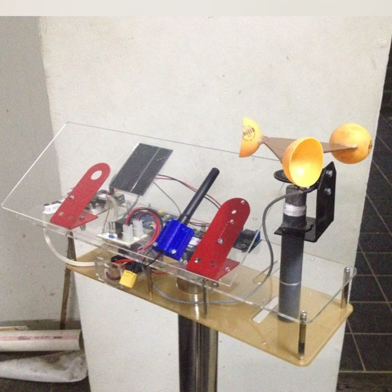
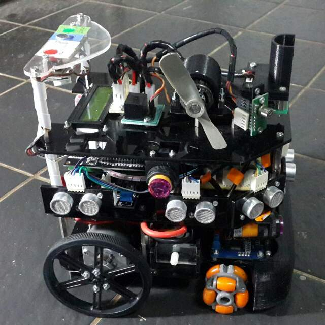

### _**Some publicly available projects**_

## [fogoh, 2019](https://github.com/adikabintang/fogoh)

[Fogoh](https://github.com/adikabintang/fogoh) (2019, at Aalto University as an individual special assignment) is a proof of concept for orchestrating video analytics at the edge with kubernetes. The main idea is to have edge network devices as the kubernetes nodes so that they are physically near to the source of the data, hence reduce the network latency. 

It used lightweight kubernetes, [k3s](https://k3s.io/). The video analytics program was written in Python with OpenCV and [YOLO](https://pjreddie.com/darknet/yolo/).

## [how-quic, 2019](https://github.com/adikabintang/how-quic)

With TCP, we can best estimate the round trip time from the client side. If we sit in the middle, TCP provides nothing for us to know when the response from the server arrives to the client. QUIC's spin bit allows us to estimate the round trip time even if we are just on the way of the packet transmission.

[how-quic](https://github.com/adikabintang/how-quic) (summer 2019) was my individual attempt to learn how to read RFC and parse network data bit by bit using libpcap in C. At that time, QUIC was still on draft-22. After reading the article about [QUIC measurement](https://www.ietfjournal.org/enabling-internet-measurement-with-the-quic-spin-bit/), I continued to read the [RFC draft](https://tools.ietf.org/html/draft-ietf-quic-transport-22#page-95) to implement this.

## [MEMCE, 2015](https://github.com/adikabintang/memce2-mikon)

We (Sanadhi Sutandi, Jendra Dwiputra, and me) built this device, including the backend, to compete in GEMASTIK (a national IT competition for university students). Out of 262 competitors, we were selected as the top-10 finalist and we presented our work at UGM Yogyakarta in 2015. We didn't win. But, _nasi kucing_ and _oseng mercon_ at Stasiun Tugu still made us happy.

Anyway, a bunch of sensors, STM32F1 ARM microcontrollers, C, PHP with Yii framework for the backend, were the main things of our project. We had some fun. Those people in the group were good and fun.

Oh, we had [a video!](https://www.youtube.com/watch?v=OvE4thOgpaQ)

## Wheeled Robot, 2015

The first serious project I had. A bunch of sensors and actuators, STM32F4 ARM microcontroller, more sensors and controllers, blood, sweat, and money. We competed in national competition of robotics. The first time we did that (not with the robot above), we got 4th position. The second one (with the robot on the picture), we didn't win at all. But again, we had fun.

I met a lot of great people from this student group. It was a good way to make friends. A really really good way. What a fun memory to remember.